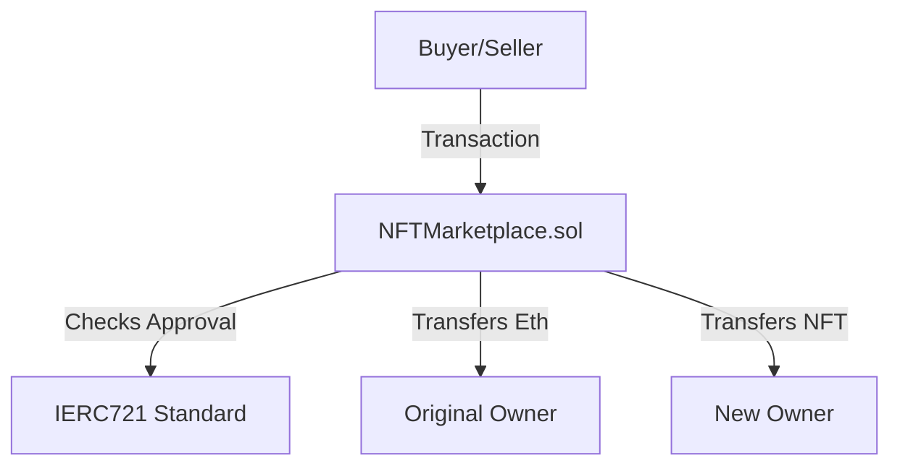

# Sol-NFT-Marketplace

A gas-optimized, secure smart contract for decentralized NFT trading.

## System Architecture

## Elite Features
- **Reentrancy Guards**: Inherits OpenZeppelin's `ReentrancyGuard` for state safety.
- **Gas Optimized**: Memory caching of storage variables (`Listing memory listedItem`).
- **Pull over Push**: Safe low-level `.call{value: x}("")` for Ether transfers.
